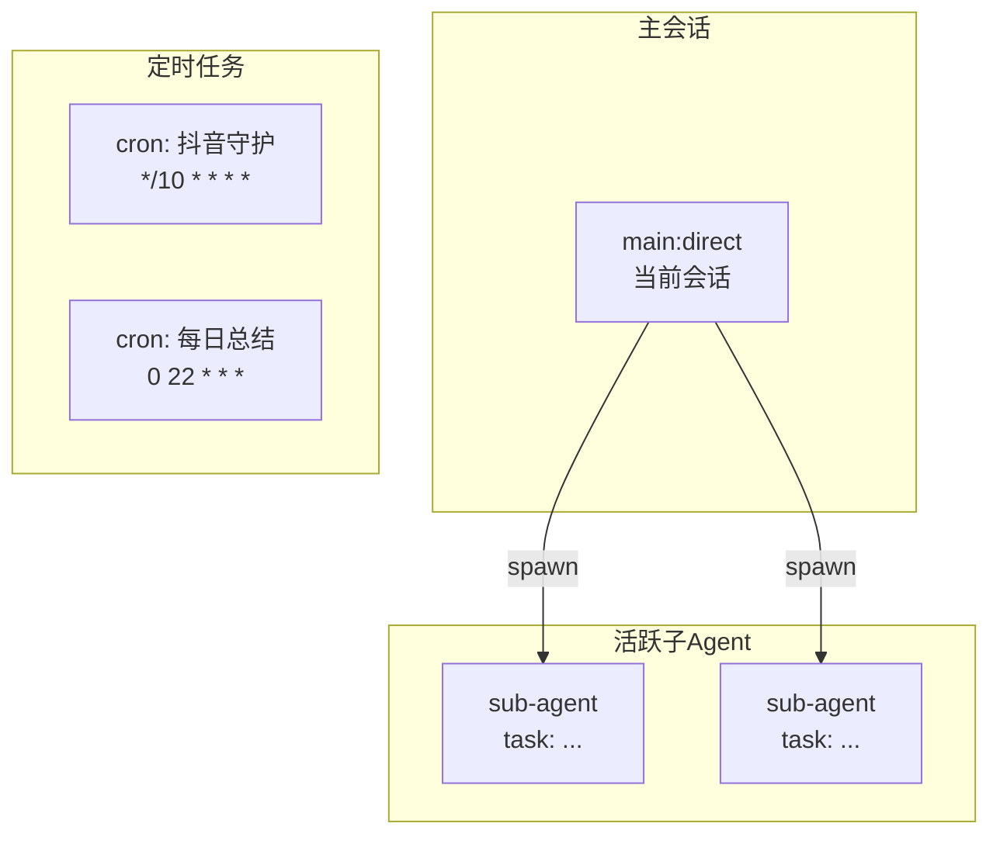

# Session Graph — 会话拓扑图

## 原理

通过 `sessions_list` + `subagents list` + `openclaw cron list` 获取当前所有活跃会话、子 agent、定时任务的信息，然后用 Mermaid 生成关系图。

## 命令

### 完整拓扑图

显示主会话、子 agent、定时任务之间的关系：



### 查看当前拓扑

执行 `sessions_list` 和 `subagents list` 获取实时数据后，用 Mermaid 代码块呈现。

## 输出示例

```
━━ 会话拓扑 ━━━━━━━━━━━━━━━━
┃ 🧵 main:direct          ← 你现在的位置
┃  ├─ 🔄 sub-agent: 天气检查   [DeepSeek V4 Flash]
┃  ├─ 🔄 sub-agent: 文件处理   [DeepSeek V4 Pro]
┃  └─ ⏰ cron: 每日续火花      [07:30 everyday]
━━━━━━━━━━━━━━━━━━━━━━━━━
```

或在需要精确渲染时用 Mermaid 图表。

## 用法

用户说「看看当前有哪些会话」「会话拓扑」「session 状态」「后台在跑什么」时：
1. 执行 `sessions_list` 和 `subagents list`
2. 用 Mermaid/ASCII 输出状态图
3. 标注每个会话的模型、任务、状态
